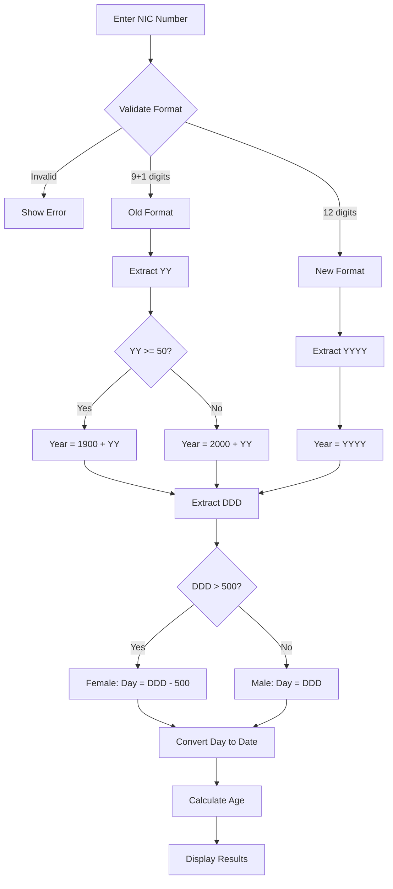

# 🇱🇰 Sri Lankan NIC Information Finder

[](https://nicinfo.vercel.app)
[](https://nextjs.org)
[](https://react.dev)
[](https://www.typescriptlang.org)
[](LICENSE)

A free, privacy-first web application to extract **birthday**, **gender**, and **age** from Sri Lankan National Identity Card (NIC) numbers. Works 100% client-side – no data ever leaves your browser.

🌐 **Live Demo**: [https://nicinfo.vercel.app](https://nicinfo.vercel.app)


---

## ✨ Features

| Feature | Description |
|---------|-------------|
| 🎂 **Birthday Extraction** | Decodes birth date from NIC number |
| 👤 **Gender Detection** | Identifies male/female from day-of-year encoding |
| 📅 **Age Calculation** | Precise age in years, months, and days |
| 🌏 **Multi-Language** | English, සිංහල (Sinhala), தமிழ் (Tamil) |
| 🔒 **100% Private** | All processing in-browser, no server requests |
| 📱 **Responsive** | Works on mobile, tablet, and desktop |
| 🌓 **Dark/Light Mode** | Auto-detects system preference |
| 📤 **Social Sharing** | Share via WhatsApp, Facebook, Twitter |
| 📋 **Copy to Clipboard** | One-click copy for results |
| 📆 **Calendar View** | Interactive calendar popup for birthday |

---

## 🆔 NIC Format Support

### Old Format (9 digits + letter)
```
YYDDDNNNNC
Example: 941234567V
```
- `YY` – Last 2 digits of birth year
- `DDD` – Day of year (001-366 male, 501-866 female)
- `NNNN` – Serial number
- `C` – Check character (V or X)

### New Format (12 digits)
```
YYYYDDDNNNNN
Example: 199412345678
```
- `YYYY` – Full 4-digit birth year
- `DDD` – Day of year (001-366 male, 501-866 female)
- `NNNNN` – Serial number

---

## � How NIC Decoding Works

### Visual Breakdown: Old Format NIC

```
┌──────────────────────────────────────────────────────────┐
│                    NIC: 941234567V                       │
├──────────────────────────────────────────────────────────┤
│   94    │   123   │   4567   │   V                       │
│  ────   │  ─────  │  ──────  │  ───                      │
│  Year   │  Day    │  Serial  │  Check                    │
│  (YY)   │  (DDD)  │  (NNNN)  │  (C)                      │
└──────────────────────────────────────────────────────────┘
          │         │
          ▼         ▼
    Birth Year   Day of Year
      1994         123
                    │
                    ▼
              May 3, 1994
              (Male)
```

### Visual Breakdown: New Format NIC

```
┌──────────────────────────────────────────────────────────┐
│                  NIC: 200012345678                       │
├──────────────────────────────────────────────────────────┤
│   2000   │   123   │   45678                             │
│  ──────  │  ─────  │  ───────                            │
│   Year   │   Day   │   Serial                            │
│  (YYYY)  │  (DDD)  │  (NNNNN)                            │
└──────────────────────────────────────────────────────────┘
           │         │
           ▼         ▼
     Birth Year   Day of Year
       2000         123
                     │
                     ▼
               May 2, 2000
                (Male)
```

### Decoding Flow



### Gender Detection Logic

```
┌─────────────────────────────────────────────────────────┐
│              Day of Year (DDD) Ranges                   │
├─────────────────────────────────────────────────────────┤
│                                                         │
│   MALE                          FEMALE                  │
│   ────                          ──────                  │
│   001 - 366                     501 - 866               │
│   (Actual day)                  (Day + 500)             │
│                                                         │
│   Example:                      Example:                │
│   DDD = 123                     DDD = 623               │
│   Day = 123                     Day = 623 - 500 = 123   │
│   Gender = Male                 Gender = Female         │
│                                                         │
└─────────────────────────────────────────────────────────┘
```

### Day of Year to Date Conversion

| Day Range | Month | Example |
|-----------|-------|---------|
| 001 - 031 | January | Day 15 → Jan 15 |
| 032 - 059 | February | Day 45 → Feb 14 |
| 060 - 090 | March | Day 75 → Mar 16 |
| 091 - 120 | April | Day 100 → Apr 10 |
| 121 - 151 | May | Day 123 → May 3 |
| 152 - 181 | June | Day 160 → Jun 9 |
| 182 - 212 | July | Day 200 → Jul 19 |
| 213 - 243 | August | Day 225 → Aug 13 |
| 244 - 273 | September | Day 260 → Sep 17 |
| 274 - 304 | October | Day 280 → Oct 7 |
| 305 - 334 | November | Day 320 → Nov 16 |
| 335 - 366 | December | Day 350 → Dec 16 |

> **Note:** Leap years have 366 days, adding an extra day in February.

### Complete Example

```
┌─────────────────────────────────────────────────────────┐
│  INPUT: 941234567V                                      │
├─────────────────────────────────────────────────────────┤
│                                                         │
│  Step 1: Validate Format                                │
│  ✓ 9 digits + V/X = Old Format                          │
│                                                         │
│  Step 2: Extract Year                                   │
│  YY = 94 → 94 >= 50 → Year = 1994                       │
│                                                         │
│  Step 3: Extract Day & Gender                           │
│  DDD = 123 → 123 < 500 → Male                           │
│  Actual Day = 123                                       │
│                                                         │
│  Step 4: Convert Day to Date                            │
│  Day 123 of 1994 = May 3, 1994                          │
│                                                         │
│  Step 5: Calculate Age                                  │
│  From May 3, 1994 to Jan 19, 2026                       │
│  = 31 years, 8 months, 16 days                          │
│                                                         │
├─────────────────────────────────────────────────────────┤
│  OUTPUT:                                                │
│  🎂 Birthday: May 3, 1994                               │
│  👤 Gender: Male                                        │
│  📅 Age: 31 years, 8 months, 16 days                    │
└─────────────────────────────────────────────────────────┘
```

## �🛠️ Tech Stack

| Category | Technology |
|----------|------------|
| **Framework** | [Next.js 16](https://nextjs.org) with App Router |
| **UI Library** | [React 19](https://react.dev) |
| **Language** | [TypeScript 5](https://www.typescriptlang.org) |
| **Styling** | [Tailwind CSS 4](https://tailwindcss.com) |
| **Animations** | [Framer Motion](https://www.framer.com/motion) |
| **i18n** | [react-intl](https://formatjs.io/docs/react-intl) |
| **UI Components** | [Radix UI](https://www.radix-ui.com) |
| **Deployment** | [Vercel](https://vercel.com) |

---

## 📁 Project Structure

```
nic-information-finder/
├── src/
│   ├── app/
│   │   ├── [locale]/              # Locale-based routing
│   │   │   ├── components/        # UI Components
│   │   │   │   ├── NICInput.tsx       # NIC input with validation
│   │   │   │   ├── ResultsDisplay.tsx # Birthday, gender, age display
│   │   │   │   ├── CalendarPopover.tsx# Calendar popup
│   │   │   │   ├── LanguageSwitcher.tsx
│   │   │   │   ├── ThemeToggle.tsx
│   │   │   │   ├── FAQSection.tsx
│   │   │   │   ├── HistorySection.tsx
│   │   │   │   └── SocialShare.tsx
│   │   │   ├── layout.tsx         # Root layout with metadata
│   │   │   ├── page.tsx           # Main page
│   │   │   └── json-ld.tsx        # Structured data (10 schemas)
│   │   ├── globals.css            # Global styles
│   │   └── sitemap.ts             # Dynamic sitemap
│   ├── lib/
│   │   ├── nic-utils.ts           # NIC parsing & validation
│   │   ├── i18n.ts                # Internationalization config
│   │   └── theme.ts               # Theme utilities
│   ├── providers/
│   │   ├── ThemeProvider.tsx      # Dark/light mode context
│   │   └── IntlProvider.tsx       # i18n context
│   └── middleware.ts              # Locale detection & routing
├── messages/
│   ├── en.json                    # English translations
│   ├── si.json                    # Sinhala translations
│   └── ta.json                    # Tamil translations
├── public/
│   ├── og-image.png               # Open Graph image
│   ├── manifest.json              # PWA manifest
│   ├── robots.txt                 # Search engine directives
│   └── llms.txt                   # AI crawler info
└── next.config.ts                 # Next.js configuration
```

---

## 🚀 Getting Started

### Prerequisites
- Node.js 18+
- npm or yarn

### Installation

```bash
# Clone the repository
git clone https://github.com/pubudutharanga/nic-information-finder.git
cd nic-information-finder

# Install dependencies
npm install

# Start development server
npm run dev
```

Open [http://localhost:3000](http://localhost:3000) in your browser.

### Build for Production

```bash
npm run build
npm start
```

---

## 🌐 Environment Variables

Create a `.env.local` file (optional):

```env
# Base URL for SEO (defaults to nicinfo.vercel.app)
NEXT_PUBLIC_BASE_URL=https://nicinfo.vercel.app
```

---

## 🔐 Privacy & Security

This tool guarantees complete privacy:

- ✅ **100% Client-Side** – All NIC processing happens in your browser
- ✅ **No Server Requests** – NIC data never leaves your device
- ✅ **No Cookies** – No tracking cookies for NIC data
- ✅ **No Analytics on Input** – Google Analytics tracks page views only
- ✅ **Security Headers** – XSS protection, CSP, and more
- ✅ **Open Source** – Fully transparent implementation

---

## 📊 SEO Features

- **10 JSON-LD Schemas**: WebApplication, Organization, FAQPage, HowTo, etc.
- **Dynamic Sitemap**: Auto-generated for all locales
- **Meta Tags**: Complete Open Graph and Twitter Card support
- **robots.txt**: Configured for search engines and AI crawlers
- **Google Analytics**: Integrated (G-FLEV55JTJJ)
- **Structured Data**: 10/10 Rich Results score

---

## 🤝 Contributing

Contributions are welcome! Please feel free to submit a Pull Request.

1. Fork the repository
2. Create your feature branch (`git checkout -b feature/amazing-feature`)
3. Commit your changes (`git commit -m 'Add amazing feature'`)
4. Push to the branch (`git push origin feature/amazing-feature`)
5. Open a Pull Request

---

## 📄 License

This project is licensed under the MIT License - see the [LICENSE](LICENSE) file for details.

---

## 👨‍💻 Developer

**Pubudu Tharanga**

- 🌐 Website: [pubudu-tharanga.vercel.app](https://pubudu-tharanga.vercel.app)
- 📧 Contact: [nicinfo.vercel.app](https://nicinfo.vercel.app)

---

## ⚠️ Disclaimer

This tool is for **informational and educational purposes only**. For official documents and services, please contact the Department for Registration of Persons (DRP) of Sri Lanka at [www.drp.gov.lk](https://www.drp.gov.lk).

---

<p align="center">Developed by Pubudu Tharanga</p>
